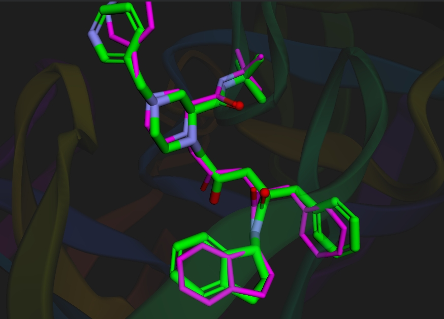

# HIV-1 Protease & Indinavir Molecular Docking 🧬

An end-to-end, reproducible Google Colab tutorial for molecular docking and re-docking benchmark validation using modern computational biology tools.

---

## 📌 Project Highlights
* **Target Receptor:** HIV-1 Protease catalytic dimer (PDB ID: `1HSG`)
* **Reference Ligand:** Indinavir (`MK1`)
* **Docking Engine:** AutoDock Vina v1.2.7
* **Modern Stack:** RDKit (`ETKDGv3` conformer embedding), Meeko (PDBQT parameterization & torsion tree), PDB2PQR, OpenBabel, and py3Dmol.
* **Benchmark Standard:** Evaluated via symmetry-corrected heavy-atom RMSD (Hungarian algorithm via `spyrmsd`).

---

## 🚀 Quick Access
Run the complete, self-contained pipeline directly in your browser without local installation:

----

## 📊 Key Results & Benchmark Validation

### 1. Docking Scoring Summary
AutoDock Vina predicted the top 9 binding modes centered on the catalytic `Asp25/Asp25'` pocket:

| Mode | Affinity (kcal/mol) | RMSD l.b. | RMSD u.b. |
| :---: | :---: | :---: | :---: |
| **1** | **-10.89** | **0.000** | **0.000** |
| 2 | -10.73 | 1.984 | 10.980 |
| 3 | -10.50 | 1.948 | 10.220 |
| 4 | -10.03 | 2.370 | 11.040 |
| 5 | -9.99 | 2.239 | 10.740 |

> **Validation Status:** Pose 1 yielded a **Symmetry-Corrected Heavy-Atom RMSD of 0.66 Å** relative to the experimental crystallographic coordinates (`xtal_ligand.pdb`), successfully achieving the rigorous benchmark threshold ($\text{RMSD} \le 2.0\text{ \AA}$).

---

### 2. Structural Superposition & Visual Inspection
Comparison of the predicted binding pose against the experimentally resolved crystal structure:

  

* **Predicted Pose 1 (AutoDock Vina):** **Green sticks**
* **Experimental Crystal Structure (PDB: 1HSG):** **Magenta sticks**
* **Heteroatoms:** Oxygen (Red) and Nitrogen (Blue)
* **Receptor:** HIV-1 Protease binding pocket shown in the background (dimmed cartoon).

> **Observation:** Near-perfect alignment of the core scaffold, central transition-state mimic hydroxyl, and hydrophobic aromatic rings, confirming the **0.66 Å** heavy-atom RMSD.

---

## 🛠️ Workflow Overview
1. **Target Curation:** Downloaded `1HSG`, stripped water molecules and non-receptor heteroatoms, and protonated the structure.
2. **Ligand Conformation & Parameterization:** Derived from canonical SMILES, embedded in 3D using RDKit's ETKDGv3, energy-minimized with MMFF94, and parameterized with Meeko.
3. **Interactive Search Space:** Grid box centered around the catalytic dyad using `py3Dmol` widgets.
4. **Vina Simulation:** Executed search with exhaustiveness set to 16.
5. **Validation:** Assessed pose fidelity using graph-isomorphic RMSD calculation.

---

## 📄 License
This repository is licensed under the [MIT License](LICENSE).
